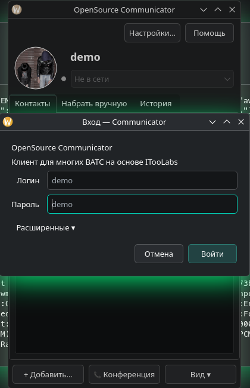
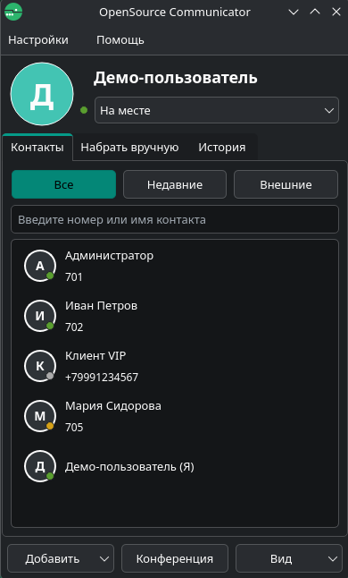
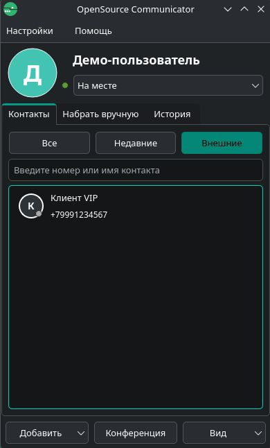
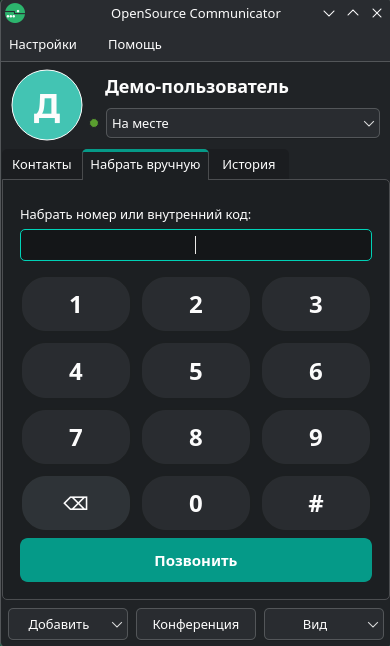
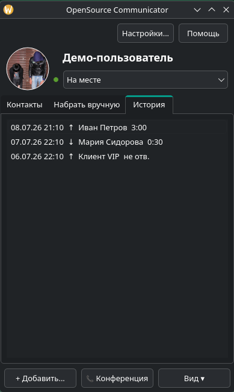
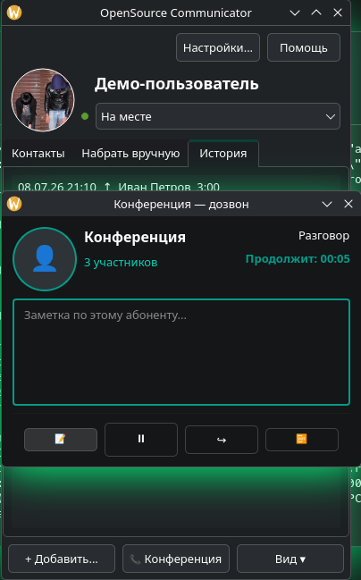
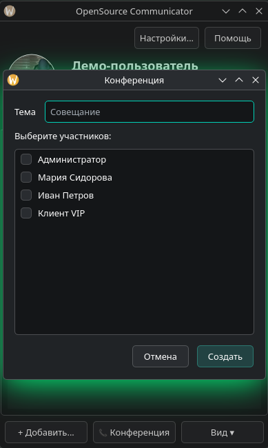
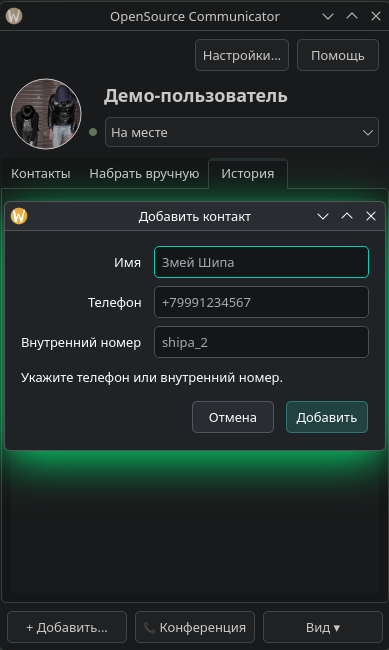
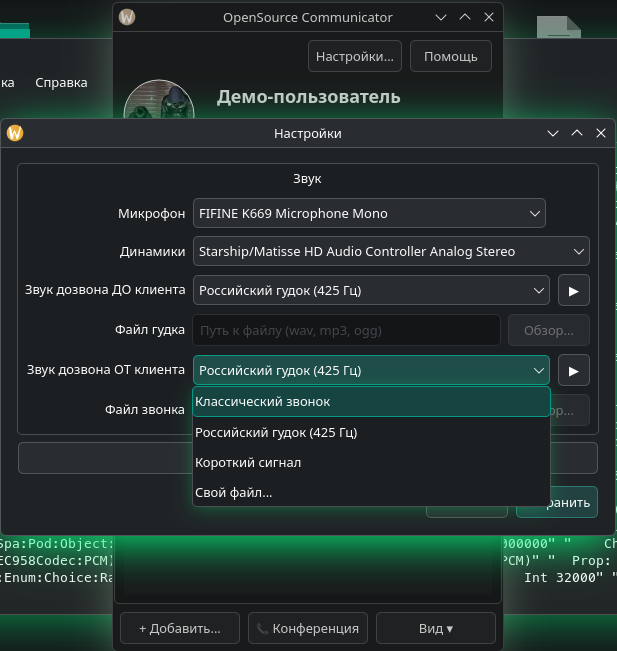

<p align="center">
  
</p>

# OpenSource Communicator

Совместимый open-source клиент для **ITooLabs Communicator** (Megafon PBX, virtual-ats и др.) на **Qt 6**.

## Скриншоты

### Вход



### Контакты





### Набор и история





### Звонок и заметки



### Конференция и контакты





### Настройки



## Возможности (v0.1)

- WebSocket-протокол ITooLabs (seq/ack, login, Bind, BindIM)
- Контакты домена и presence
- Чат (через BindIM + SMS API)
- Звонки: сигнализация + WebRTC через libdatachannel
- Демо-режим (`demo` / `demo`) без подключения к серверу
- Без телеметрии Amplitude/Sentry

## Установка (Arch Linux / AUR)

```bash
cd packaging/aur
makepkg -si
```

Пакет `opensource-communicator-git` собирает клиент из ветки `main` и ставит его
в `/usr`. Подробности и инструкция по публикации в AUR — в `packaging/aur/README.md`.

## Сборка (Linux)

```bash
cd client
cmake -B build -DCMAKE_BUILD_TYPE=Release
cmake --build build
sudo cmake --install build
```

По умолчанию установка идёт в `/opt/opensource-communicator`:

- бинарник: `/opt/opensource-communicator/bin/opensource-communicator`
- `.desktop`: `/opt/opensource-communicator/share/applications/opensource-communicator.desktop`

Другой префикс:

```bash
cmake -B build -DCMAKE_BUILD_TYPE=Release -DCMAKE_INSTALL_PREFIX=/usr/local
cmake --build build
sudo cmake --install build
```

### Зависимости (Arch)

- `qt6-base` `qt6-websockets` `qt6-multimedia`
- `cmake`
- `libdatachannel`
- `opus`

### Windows (готовая сборка)

Portable ZIP для Windows собирается в **GitHub Actions**:

1. [Actions → Build releases](https://github.com/shipa-2/Opensource-Communicator/actions/workflows/build.yml)
2. **Run workflow** → ветка `main`
3. Скачайте артефакт `windows-portable`

При push тега `v*` создаётся GitHub Release с ZIP для Windows.

## Использование

1. Запустите приложение
2. Для просмотра интерфейса без сервера введите `demo` / `demo`
3. Для подключения к ВАТС укажите логин вида `user@domain.itoolabs.ru`, пароль и домен
4. Для Megafon: partner = `megafon`, auth-домен обычно совпадает с доменом АТС

## Структура

```
client/           — Qt6 приложение (open-source реализация)
screenshots/      — скриншоты интерфейса
PROTOCOL.md       — описание протокола ITooLabs WS
README.md         — этот файл
```

Локально для разбора могут лежать `extracted/`, `reverse-engineered/`, установщики — они в `.gitignore` и не публикуются.

## Лицензия

Оригинальный Megafon / ITooLabs Communicator — проприетарный продукт.
Этот проект — независимая реализация протокола, не аффилирован с Megafon или ITooLabs.
