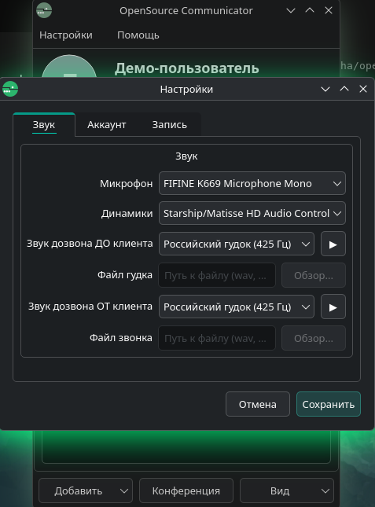
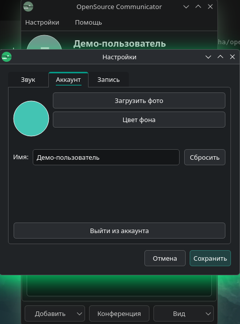
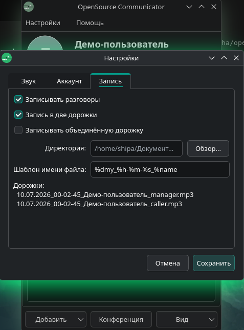

<p align="center">
  
</p>

<p align="center">
  <sub>
    На логотипе изображён спортсмен на роликах, размахивающий руками.
    Логотип не является ассоциацией, товарным знаком или пародией на «Мегафон»
    и не связан с ним.
  </sub>
</p>

# OpenSource Communicator

Совместимый open-source клиент для **ITooLabs Communicator** (Megafon PBX, virtual-ats и др.) на **Qt 6**.

**[⬇ Установка (Arch Linux / AUR)](#установка-arch-linux--aur)** · **[⬇ Установка (Windows)](#установка-windows)**


## Скриншоты

### Вход


### Контакты


### Набор и история


### Звонок и заметки


### Конференция и контакты


### Настройки







## Возможности (v0.4)

- WebSocket-протокол ITooLabs (seq/ack, login, Bind, BindIM)
- Контакты домена и presence; **личные контакты на сервере** — добавленные вручную или импортированные сохраняются в адресной книге ВАТС и доступны после входа с любого компьютера
- Импорт/экспорт личных контактов CSV и vCard; drag-and-drop по всему окну
- Чат (через BindIM + SMS API): **вложения до 96 КБ** (кнопка «+»), **кликабельные ссылки** в сообщениях
- Звонки: сигнализация + WebRTC через libdatachannel, **удержание с renegotiation SDP**, слепой перевод, DTMF в окне звонка
- **Передача цвета аватарки** между пользователями через IM (формат `**#RRGGBB**`)
- **OpenSource Communicator ↔ OSC** — `Openping!`, обмен аватаркой (`**fnm=avatar.png;…**`), **файлами в чате** (`**fnm=…;enc=b64;…**`, до 96 КБ) и темой (обои + затемнение; `Themeapplied!` после применения); см. [PROTOCOL.md](PROTOCOL.md#расширения-opensource-communicator-im)
- **Обои и тема** — фон главного окна, затемнение интерфейса и списков, «Поделиться темой» OSC-пиру
- **Экспериментальные видеозвонки** — камера или демонстрация экрана, H.264/WebRTC, локальное/удалённое превью, выключение и блюр исходящего видео при `videoEnabled` на сервере (`--allowvideo`)
- **Интерфейс звонка**: крупный круглый аватар с кольцом подсветки голоса **поверх** фото, статусы «Удержание» / «На удержании», заметки, кнопки с текстовыми подписями
- **MPRIS (Linux)**: при звонке ставится на паузу внешняя медиа; после звонка **возобновляются только те плееры, что играли до него**
- **Настройки с вкладками**: звук, аккаунт (аватар, имя, выход), запись (одна/две/объединённая дорожки)
- Запись разговоров в MP3 (одна, две или объединённая дорожки; нужен `ffmpeg` или `lame`)
- История звонков с фильтрами и поиском
- Конференция с выбором собеседников и слушателей
- Демо-режим (`demo` / `demo`) без подключения к серверу: через ~5 с после входа **Администратор** появляется как OSC-пир и присылает файл `Hello world.txt`
- **`--newinstance`** — второй параллельный клиент; **свой сервер** — порт и debug TLS в расширенном входе
- Без телеметрии Amplitude/Sentry

Полный список изменений: [CHANGELOG.md](CHANGELOG.md).

## Установка (Arch Linux / AUR)

```bash
yay -S opensource-communicator-git
```

Пакет [`opensource-communicator-git`](https://aur.archlinux.org/packages/opensource-communicator-git)
собирает клиент из ветки `main` и ставит его в `/usr`.

## Установка (Windows)

Portable ZIP для Windows и tar.gz для Linux публикуются в [GitHub Releases](https://github.com/shipa-2/Opensource-Communicator/releases):

1. Откройте страницу релиза (например, [последний](https://github.com/shipa-2/Opensource-Communicator/releases/latest))
2. Скачайте `OpenSource-Communicator-*-win64.zip` (Windows) или `OpenSource-Communicator-*-linux-x86_64.tar.gz` (Linux)

Распакуйте архив в любую папку и запустите `opensource-communicator` / `opensource-communicator.exe`. Установщик (MSI) не нужен.

Для отладки в [Actions](https://github.com/shipa-2/Opensource-Communicator/actions/workflows/build.yml) доступны артефакты `*-Debug` — сборка с окном консоли и полными логами протокола/звонков.

При push в `main` CI автоматически создаёт/обновляет GitHub Release с тегом **ДДММГГГГ** (дата сборки) и прикрепляет **Release**-артефакты (Windows ZIP и Linux tar.gz). Push в экспериментальную ветку `videotest` собирает те же Linux/Windows Release+Debug артефакты только в Actions, без публикации GitHub Release.

**В релизах только клиент.** Исходники сигнализационного сервера лежат в репозитории (`server/`), но **не собираются CI и не публикуются** в GitHub Releases — их нужно собрать локально (см. ниже).

## Сигнализационный сервер (`server/`)

С **0.4.0** в репозитории есть **communicator-server** — совместимый с клиентом WebSocket-сервер (IM, presence, звонки, hold music, PostgreSQL). Подходит для локальной разработки и self-hosted развёртывания.

```bash
cd server
cmake -B build -DCMAKE_BUILD_TYPE=Release
cmake --build build -j$(nproc)
./build/communicator-server --demo --port 8443 --oncall --allowvideo
```

Зависимости: Qt6 (Core, WebSockets, Network, Sql), PostgreSQL, OpenSSL, CMake ≥ 3.16. Полная документация, флаги CLI и схема БД — в **[server/README.md](server/README.md)**.

В клиенте укажите домен сервера, в **Расширенные → Порт сервера** — например `8443`. В debug-сборке доступен чекбокс «Игнорировать небезопасный TLS» для `ws://` или self-signed `wss://`.

## Сборка (Linux)

```bash
cd client
cmake -B build -DCMAKE_BUILD_TYPE=Release
cmake --build build
sudo cmake --install build
```

По умолчанию установка идёт в `/opt/opensource-communicator`:

- бинарник: `/opt/opensource-communicator/bin/opensource-communicator`
- `.desktop`: `/opt/opensource-communicator/share/applications/opensource-communicator.desktop`

Другой префикс:

```bash
cmake -B build -DCMAKE_BUILD_TYPE=Release -DCMAKE_INSTALL_PREFIX=/usr/local
cmake --build build
sudo cmake --install build
```

### Зависимости (Arch)

- `qt6-base` `qt6-websockets` `qt6-multimedia`
- `cmake`
- `libdatachannel`
- `opus`
- `openh264`
- `ffmpeg` или `lame` (необязательно, для конвертации записей в MP3)

Готовая сборка для Windows — в разделе [Установка (Windows)](#установка-windows). GitHub Actions также собирает Linux-бинарник (артефакты `linux-build-Release` / `linux-build-Debug`, tar.gz) на Ubuntu 24.04. Архив содержит совместимую библиотеку OpenH264; Qt 6 и остальные системные библиотеки должны быть установлены в системе.

### Типы сборки (Debug / Release)

| | **Release** (по умолчанию) | **Debug** |
|---|---------------------------|-----------|
| Назначение | Повседневное использование, CI, релизы | Разработка и отладка |
| Оптимизация | Включена | Отключена, символы отладки |
| Логи | Только предупреждения и ошибки | Полный вывод `itl.*` в консоль |
| Windows | Без окна терминала (GUI-приложение) | Консоль с логами при запуске |
| Linux | Логи в stderr при запуске из терминала | То же, но подробнее |

```bash
# Release (по умолчанию)
cmake -B build -DCMAKE_BUILD_TYPE=Release
cmake --build build

# Debug
cmake -B build-debug -DCMAKE_BUILD_TYPE=Debug
cmake --build build-debug
```

На Windows в Debug-сборке запускайте `opensource-communicator.exe` из `ucrt64`/`cmd`, чтобы видеть логи протокола и звонков. В GitHub Actions доступны оба артефакта: `windows-portable-Release` и `windows-portable-Debug`.

## Использование

1. Запустите приложение
2. Для просмотра интерфейса без сервера введите `demo` / `demo`
3. Для подключения к ВАТС укажите логин вида `user@domain.itoolabs.ru`, пароль и домен
4. Для Megafon: partner = `megafon`, auth-домен обычно совпадает с доменом АТС
5. Для своего сервера: **Расширенные** → **Порт сервера** (пусто = 443, для локального сервера часто `8443`)

### Личные контакты на сервере

Контакты, которые вы добавляете через **Добавить → Контакт** или **Импорт**, сохраняются в адресной книге на сервере ВАТС (команды `createcontact` / `uploadcontacts`, подписка `[CONTACTS]`). После входа с другого ПК или ноутбука они подтягиваются автоматически.

Ранее сохранённые только локально контакты при первом входе после обновления один раз загружаются на сервер (`uploadcontacts`). В демо-режиме (`demo` / `demo`) контакты по-прежнему хранятся только локально.

### Цвет аватарки и OSC-обмен

При входе приложение отправляет цвет аватарки другим пользователям в формате `**#RRGGBB**`. Полученные цвета применяются к аватаркам контактов и отображаются в окне звонка. Сообщения-рекламы не отображаются в чате.

Между клиентами **OpenSource Communicator** (после `Openping!`) доступны обмен фото аватарки, **файлами в чате** (до 96 КБ, клик по уведомлению → сохранить) и **темой** (обои + затемнение интерфейса/списков). После применения темы получатель отправляет отправителю `Themeapplied!` — в чате появится «*Имя* применил вашу тему». У OSC-пиров в списке контактов — **кольцо присутствия** и короткая анимация при обнаружении. Подробности: [PROTOCOL.md — расширения OSC](PROTOCOL.md#расширения-opensource-communicator-im).

### Чат

- Кнопка **+** слева от поля ввода — отправить файл (не SMS).
- Ссылки `http://`, `https://` и `www.…` в тексте сообщений открываются по клику.
- Уведомления о файле и теме отображаются отдельной строкой с кликабельной ссылкой.

### Контекстное меню

- **ПКМ по контакту**: Звонок (с выбором номера), Сообщение, Заметка, Удалить, Экспортировать; **Видеозвонок** — если сервер поддерживает video
- **ПКМ по своему контакту**: Скопировать личный номер, Скопировать рабочий номер
- **Двойной клик**: Открыть заметку

### Настройки

Диалог **Настройки** содержит три вкладки:

- **Звук**: микрофон, динамики, звуки дозвона
- **Аккаунт**: аватар (фото/цвет), обои (фон окна, затемнение, «Поделиться темой»), отображаемое имя, выход из аккаунта
- **Запись**: включение, одна/две/объединённая дорожки, директория, шаблон имени файла

### Интерфейс звонка

При голосовом звонке отображается компактное окно с:
- Имя/номер собеседника
- Круглый аватар (фото или буква) с цветом контакта; **кольцо подсветки голоса рисуется поверх** аватарки
- Статус и таймер
- Заметки
- Кнопки: Перевод, Сброс (акцентный цвет), Удержание

Видеозвонок использует широкую компоновку:

- одна верхняя строка: ФИО, номер, статус и цифровой таймер;
- удалённое видео 16:9 слева, локальное превью справа;
- справа — «Стоп видео», демонстрация экрана и блюр исходящего видео;
- снизу — «Перевод», «Сброс», «Удержание».

**Входящий звонок** не забирает фокус у других окон; **Esc** не сбрасывает вызов (исправление критического бага в 0.3.0).

### Экспериментальные видеозвонки

Сервер должен вернуть `videoEnabled: true` из `getcommunicatorsettings`. У собственного сервера это включает флаг `--allowvideo`:

```bash
./server/build/communicator-server --port 8443 --allowvideo --oncall
```

Клиент захватывает камеру через Qt Multimedia, кодирует 640×360@15 FPS в H.264 baseline (PT 96, RTP clock 90 kHz) и передаёт через `libdatachannel`. Входящий H.264 декодируется OpenH264. На Qt ≥6.5 и KDE Plasma Wayland демонстрация экрана использует `QScreenCapture` и системный PipeWire/xdg-desktop-portal диалог; для Qt 6.4 сохранён X11-совместимый fallback через `QScreen::grabWindow()`.

Ограничения:

- функция находится в ветке `videotest` и требует проверки с реальными Megafon/ITooLabs media gateway;
- одну физическую камеру обычно нельзя одновременно открыть в двух процессах на одном ПК;
- при ошибке камеры аудиозвонок продолжается, отправка видео отключается;
- адаптивный bitrate, запрос ключевого кадра по PLI/FIR и выбор камеры в UI ещё не реализованы.

Отладка синхронизации: `QT_LOGGING_RULES="itl.addressbook=true" opensource-communicator`

## Структура

```
client/           — Qt6 клиент (open-source реализация)
server/           — сигнализационный сервер communicator-server (не в CI-релизах)
screenshots/      — скриншоты интерфейса
PROTOCOL.md       — протокол ITooLabs WS + расширения OSC (Openping, аватарка, тема)
AGENTS.md         — справка для AI-агентов (архитектура, паритет с официальным клиентом)
README.md         — этот файл
```

Локально для разбора могут лежать `extracted/`, `reverse-engineered/`, установщики — они в `.gitignore` и не публикуются.

## Лицензия

Оригинальный Megafon / ITooLabs Communicator — проприетарный продукт.
Этот проект — независимая реализация протокола, не аффилирован с Megafon или ITooLabs.
